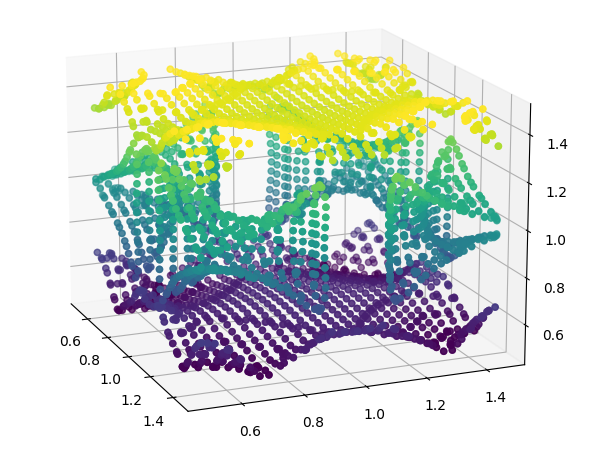

`vals_grid_tate4_relaxed.csv` has the following format

index1 index2 index3 kpt1 kpt2 kpt3 eigval1 eigval2 ... eigval68

kpt1 kpt2 kpt3 are between -0.5 and 0.5 on a 24 x 24 x 24 grid

--

`fermi_points_3d.csv` has the fermi points I found on that grid using a simple algorithm that uses linear interpolation to find where the bands are equal to zero. Plotting it is hard, but I made an effort in  `fermi_3d.png`   `fermi_3d_rotated.PNG` . The colors go from -0.5 to 0.5 along kz.

